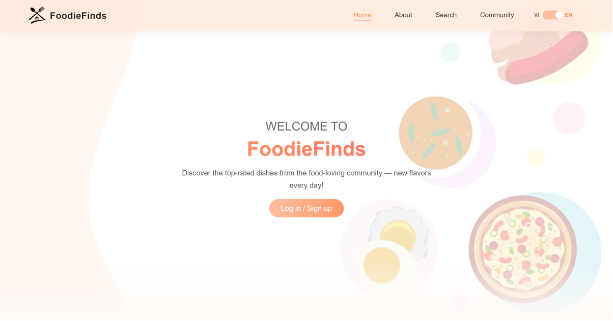
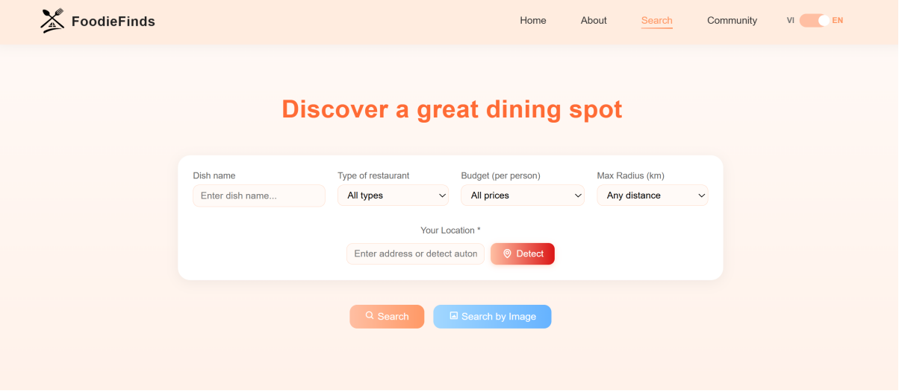
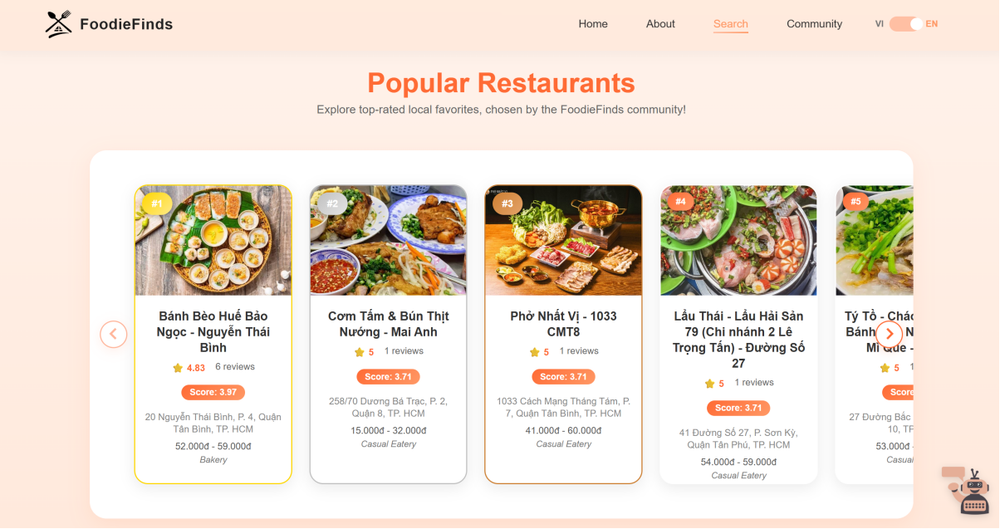

# 🍲 FoodieFinds – Smart Restaunrant Recommendation & Support System

**FoodieFinds** là một nền tảng Web thông minh hỗ trợ tìm kiếm địa điểm ăn uống, nhận diện món ăn qua hình ảnh và trợ lý ảo AI tư vấn ẩm thực.  

---

## 🌟 Tính năng nổi bật

- 🔍 **Tìm kiếm thông minh**
  - Tìm kiếm nhà hàng theo món ăn, khoảng cách (GPS), giá cả và loại hình
  - Tích hợp **Groq AI** để tự động sửa lỗi chính tả tên món ăn

- 🤖 **Chatbot AI (Deadline)**
  - Trợ lý ảo sử dụng **RAG (Retrieval-Augmented Generation)**
  - Kết hợp **ChromaDB** và **Google Gemini**
  - Trả lời dựa trên dữ liệu thực trong hệ thống

- 📸 **Nhận diện món ăn từ hình ảnh**
  - Sử dụng model **ConvNeXt Tiny (PyTorch)**
  - Dự đoán tên món ăn từ ảnh người dùng tải lên

- 📄 **Dịch menu từ hình ảnh (OCR)**
  - Trích xuất văn bản từ ảnh menu bằng **EasyOCR**
  - Dịch sang Anh / Việt bằng **Google Gemini**

- 🔐 **Hệ thống người dùng**
  - Đăng ký / Đăng nhập
  - Xác thực **OTP qua Email**
  - Quản lý hồ sơ cá nhân và ảnh đại diện

- 💬 **Cộng đồng**
  - Phòng chat cộng đồng theo chủ đề
  - Bình luận kèm hình ảnh
  - Đánh giá và chấm điểm nhà hàng


---

## 🗂️ Cấu trúc thư mục

```text
FoodieFinds/
├── static/                   # Chứa CSS, JS, hình ảnh và các file upload tạm thời
├── templates/                # Các file giao diện HTML (home, login, search, detail...)
├── .gitignore                # Khai báo các file không đưa lên GitHub (venv, .env, .db...)
├── app.py                    # File chạy chính của ứng dụng Flask
├── auth.py                   # Quản lý Đăng ký, Đăng nhập và xác thực OTP
├── chatbox.py                # Xử lý Chatbot AI (Gemini), RAG và OCR dịch Menu
├── class_names.txt           # Danh sách 30 nhãn món ăn mà model AI hỗ trợ
├── comments.py               # Quản lý bình luận, đánh giá sao và top nhà hàng
├── community.py              # Xử lý phòng chat cộng đồng và phản hồi (reactions)
├── create_food_database.py   # Script khởi tạo cơ sở dữ liệu món ăn ban đầu
├── chatbox.py                # Xử lý logic chatbot và trích xuất text từ ảnh
├── favorites.py              # Quản lý danh sách quán ăn yêu thích của người dùng
├── foods.json                # Dữ liệu tri thức về món ăn cho Chatbot RAG
├── import_dish_with_tag.py   # Script hỗ trợ import dữ liệu món ăn kèm tag vào DB
├── mail_config.py            # Cấu hình dịch vụ gửi Email (SMTP)
├── model.txt                 # Tài liệu/thông tin về kiến trúc mô hình AI
├── predict.py                # Code thực hiện dự đoán món ăn từ hình ảnh tải lên
├── README.md                 # Tài liệu hướng dẫn sử dụng dự án
├── restaurants.db            # Cơ sở dữ liệu SQLite chứa thông tin nhà hàng & món ăn
├── search.py                 # Xử lý tìm kiếm nâng cao và định vị GPS (Nominatim)
├── users.db                  # Cơ sở dữ liệu SQLite chứa thông tin User & Bình luận
├── .env                      # Chứa API Key cấu hình
├── model_convnext_tiny.pth   #  Model AI nhận diện ảnh
└── requirements.txt          # Danh sách các thư viện cần cài đặt
```


---

## 🛠 Công nghệ sử dụng

### Backend
- Flask (Python)

### Database
- SQLite (WAL Mode)
- ChromaDB (Vector Database)

### AI / Machine Learning
- Google Gemini API (LLM)
- Groq API (Spell Correction)
- PyTorch (ConvNeXt Tiny)
- Sentence-Transformers
- EasyOCR

### Frontend
- HTML5, CSS3
- JavaScript (Fetch API)
- LeafletJS (Bản đồ & GPS)

---

## 📋 Yêu cầu hệ thống

- Python **3.9+**
- RAM tối thiểu: **4GB**
- Dung lượng trống: **~2GB** (model AI)

---

## 🚀 Cài đặt & Chạy chương trình

### 1️⃣ Cài đặt thư viện
Sử dụng file requirements:
```bash
pip install -r requirements.txt
```
Hoặc cài thủ công:

```bash 
pip install flask flask-cors requests google-generativeai \
sentence-transformers chromadb pillow opencv-python \
easyocr torch torchvision flask-mailman werkzeug
```
---

### 2️⃣ API 
**Với file chatbot.py:**

Tạo file .env (đúng tên, không thêm đuôi) và thêm nội dung sau:

```bash
API_KEY=PUSH_API_HERE
```
⚠️ `Lưu ý: Không có file .env → Chatbot AI sẽ không hoạt động.`

**Với file search.py:**
Thêm API vào mục GROQ API CONFIG 

---

### 3️⃣ Mô hình nhận diện món ăn
📥 Tải Model nhận diện ảnh tại đây tại đây [**`model_convnext_tiny.pth`**](https://drive.google.com/file/d/1js3D_Sjbvli0K360iHgllD5RvezU9dxL/view?usp=sharing)

⚠️ `Lưu ý về phạm vi nhận diện:`

- Chức năng nhận diện hình ảnh chỉ hỗ trợ 30 món ăn.

- Danh sách nhãn nằm trong file: `class_names.txt`

- `❗ KHÔNG được xoá hoặc chỉnh sửa class_names.txt.`

- Upload ảnh ngoài danh sách hỗ trợ → kết quả sẽ không chính xác.

---

### 4️⃣ Chạy ứng dụng
Khởi chạy server:

```bash
python app.py
```
Truy cập ứng dụng tại: http://127.0.0.1:5000

---

### 5️⃣ Màn hình giao diện web

*(Màn hình chính)*


*(Màn hình tìm kiếm)*


*(Gợi ý top các món nên thử)*

